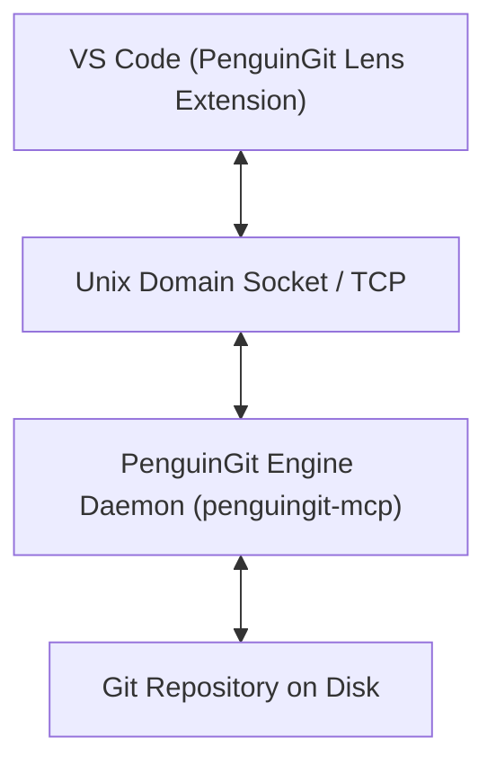

# 🐧 PenguinGit Lens

**PenguinGit Lens** is a lightweight, high-performance VS Code extension — an open-source, 100% free answer to GitLens. It brings inline blame, rich commit hover cards, a visual commit graph panel, and file revision history directly into VS Code, powered by the local **PenguinGit Engine** background daemon.

---

## ✨ Features

- 👁️ **Inline Current-Line Blame**: Subtle ghost-text annotation displaying author, relative age, and commit summary for the line under your cursor.
- 💬 **Commit Hover Cards**: Rich Markdown popups showing full commit hash, author details, relative time, summary, and quick action links.
- 📊 **Visual Commit Graph Panel**: Responsive DAG visual commit graph in the sidebar showing commit branches, lanes, refs, and messages.
- 📜 **File Revision History**: Right-click any file in Explorer to view its full commit history timeline following renames.
- 🔗 **Desktop App Handoff**: Deep-link integration (`penguingit://`) launching the PenguinGit Desktop App for complex workflows (Interactive Rebase, 3-Way Merge Conflict Resolution).

---

## 🏗️ Architecture: The Shared Engine Model

Unlike extensions that re-implement Git parsing from scratch in TypeScript, PenguinGit Lens is a thin client that talks to the local **PenguinGit Engine** daemon via JSON-RPC 2.0 / MCP over Unix domain sockets (`/tmp/penguingit-mcp.sock`) or TCP (`127.0.0.1:34284`).



---

## ⚙️ Configuration Settings

| Setting | Type | Default | Description |
|---|---|---|---|
| `penguingit.enableInlineBlame` | `boolean` | `true` | Show inline current-line blame ghost text |
| `penguingit.ghostTextFormat` | `string` | `"${author}, ${age} • ${summary}"` | Ghost text template (`${author}`, `${age}`, `${summary}`, `${hash}`) |
| `penguingit.socketPath` | `string` | `"/tmp/penguingit-mcp.sock"` | Unix domain socket path for Linux/macOS |
| `penguingit.tcpPort` | `number` | `34284` | TCP port for Windows loopback fallback |
| `penguingit.useTcp` | `boolean` | `false` | Force connection over TCP stream |

---

## 💻 Development & Packaging

1. Install dependencies:
   ```bash
   pnpm install
   ```
2. Build extension:
   ```bash
   pnpm build
   ```
3. Package `.vsix` release:
   ```bash
   npx @vscode/vsce package --no-dependencies
   ```

---

## 📜 License

MIT © [Ayush Singh (@Ayush442842q)](https://github.com/Ayush442842q/PenguinGit-lens)
